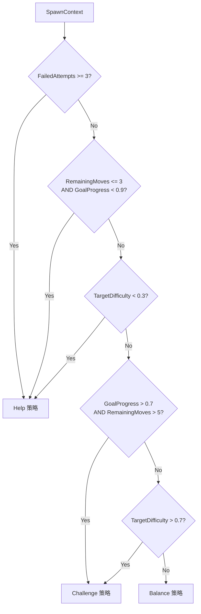

# 核心机制：生成点模型 (Spawn Model)

| 文档状态 | 作者 | 日期 | 对应版本 |
| :--- | :--- | :--- | :--- |
| **Phase 1 Implemented** | AI Assistant | 2026-01-14 | v0.1 (Rule-Based) |

## 1. 概述 (Overview)

生成点模型是控制 Match-3 游戏难度的核心系统。当棋盘顶部需要生成新方块时，该模型根据当前游戏状态智能决定生成哪种颜色，从而实现动态难度调节 (Dynamic Difficulty Adjustment, DDA)。

### 1.1 设计目标

| 目标 | 描述 |
| :--- | :--- |
| **难度可控** | 通过 `TargetDifficulty` 参数精确控制关卡难度 |
| **玩家体验** | 避免玩家连续失败或过于轻松 |
| **渐进架构** | 支持从规则驱动逐步升级到 AI 模型 |
| **向后兼容** | 通过适配器兼容现有 `ITileGenerator` 接口 |

### 1.2 架构概览

```
┌─────────────────────────────────────────────────────────────┐
│                    Spawn Model Architecture                  │
├─────────────────────────────────────────────────────────────┤
│                                                             │
│   Phase 1 (Current)     Phase 2 (Future)    Phase 3 (Future)│
│   ┌─────────────────┐   ┌──────────────┐   ┌──────────────┐ │
│   │ RuleBasedModel  │   │ HybridModel  │   │  RL Model    │ │
│   │ - 规则驱动      │   │ - 规则+统计  │   │ - 强化学习   │ │
│   │ - 即时响应      │   │ - 历史分析   │   │ - 自适应     │ │
│   └────────┬────────┘   └──────┬───────┘   └──────┬───────┘ │
│            │                   │                  │         │
│            └───────────────────┼──────────────────┘         │
│                                ▼                            │
│                    ┌───────────────────────┐                │
│                    │     ISpawnModel       │                │
│                    │  Predict(state, ctx)  │                │
│                    └───────────────────────┘                │
│                                                             │
└─────────────────────────────────────────────────────────────┘
```

---

## 2. 核心接口 (Core Interfaces)

### 2.1 ISpawnModel

生成点模型的统一接口，所有实现（规则/ML/RL）都必须实现此接口。

```csharp
public interface ISpawnModel
{
    TileType Predict(ref GameState state, int spawnX, in SpawnContext context);
}
```

| 参数 | 类型 | 描述 |
| :--- | :--- | :--- |
| `state` | `ref GameState` | 当前棋盘状态（只读） |
| `spawnX` | `int` | 生成点的 X 坐标（列） |
| `context` | `in SpawnContext` | 难度和进度上下文 |

### 2.2 SpawnContext

包含影响生成决策的上下文信息。

```csharp
public struct SpawnContext
{
    public float TargetDifficulty;  // 目标难度 (0.0=简单, 1.0=困难)
    public int RemainingMoves;      // 剩余步数
    public float GoalProgress;      // 目标完成度 (0.0~1.0)
    public int FailedAttempts;      // 连续失败次数
    public bool InFlowState;        // 是否处于心流状态
}
```

---

## 3. Phase 1: 规则驱动模型 (Rule-Based Model)

### 3.1 策略选择逻辑



### 3.2 四种生成策略

| 策略 | 触发条件 | 行为 |
| :--- | :--- | :--- |
| **Help** | 失败≥3次 / 最后几步 / 低难度 | 生成能形成消除的颜色 |
| **Challenge** | 高难度 / 玩家进展顺利 | 避免生成能消除的颜色 |
| **Balance** | 中等难度 | 平衡各颜色分布（稀有色权重高） |
| **Neutral** | 默认 | 纯随机生成 |

### 3.3 Help 策略详解

当玩家需要帮助时，系统会：

1. **预判掉落位置**：计算方块落到哪个 Y 坐标
2. **检测可消除颜色**：找出能形成 3 连的颜色
3. **优先创建消除**：生成能立即消除的颜色
4. **次选近消除**：生成能形成 2 连的颜色（为后续消除铺垫）

```csharp
private TileType SpawnHelpful(ref GameState state, int spawnX, int colorCount)
{
    // 1. 找出能创建消除的颜色
    Span<bool> wouldMatch = stackalloc bool[6];
    BoardAnalyzer.FindMatchingColors(ref state, spawnX, wouldMatch);

    // 2. 优先生成能消除的
    for (int i = 0; i < colorCount; i++)
        if (wouldMatch[i]) return Colors[i];

    // 3. 其次生成能形成近消除的
    int targetY = BoardAnalyzer.SimulateDropTarget(ref state, spawnX);
    for (int i = 0; i < colorCount; i++)
        if (BoardAnalyzer.WouldCreateNearMatch(ref state, spawnX, targetY, Colors[i]))
            return Colors[i];

    // 4. 兜底：随机
    return SpawnRandom(ref state, colorCount);
}
```

### 3.4 Challenge 策略详解

当需要增加挑战时，系统会：

1. **找出不会消除的颜色**
2. **优先生成已经过多的颜色**（制造拥堵）
3. **避免任何能消除的颜色**

```csharp
private TileType SpawnChallenging(ref GameState state, int spawnX, int colorCount)
{
    Span<bool> wouldNotMatch = stackalloc bool[6];
    BoardAnalyzer.FindNonMatchingColors(ref state, spawnX, wouldNotMatch);

    // 优先生成最多的颜色（制造拥堵）
    var commonColor = BoardAnalyzer.FindMostCommonColor(ref state, colorCount);
    int commonIndex = BoardAnalyzer.GetColorIndex(commonColor);

    if (commonIndex >= 0 && wouldNotMatch[commonIndex])
        return commonColor;

    // 其他不会消除的颜色
    for (int i = 0; i < colorCount; i++)
        if (wouldNotMatch[i]) return Colors[i];

    return SpawnRandom(ref state, colorCount);
}
```

### 3.5 Balance 策略详解

平衡各颜色分布，使棋盘颜色更均匀：

```csharp
private TileType SpawnBalanced(ref GameState state, int spawnX, int colorCount)
{
    Span<int> counts = stackalloc int[6];
    BoardAnalyzer.GetColorDistribution(ref state, counts);

    // 权重 = 100 / (count + 1)，稀有色权重更高
    Span<int> weights = stackalloc int[6];
    int totalWeight = 0;

    for (int i = 0; i < colorCount; i++)
    {
        weights[i] = 100 / (counts[i] + 1);
        totalWeight += weights[i];
    }

    // 加权随机选择
    int roll = rng.Next(0, totalWeight);
    int cumulative = 0;
    for (int i = 0; i < colorCount; i++)
    {
        cumulative += weights[i];
        if (roll < cumulative) return Colors[i];
    }

    return Colors[0];
}
```

---

## 4. 棋盘分析器 (Board Analyzer)

`BoardAnalyzer` 是一个静态工具类，提供棋盘状态分析功能。

### 4.1 核心方法

| 方法 | 用途 |
| :--- | :--- |
| `GetColorDistribution` | 统计各颜色数量 |
| `SimulateDropTarget` | 预判方块落点 Y 坐标 |
| `WouldCreateMatch` | 检测是否会形成 3 连 |
| `WouldCreateNearMatch` | 检测是否会形成 2 连 |
| `FindMatchingColors` | 找出能消除的颜色 |
| `FindNonMatchingColors` | 找出不能消除的颜色 |
| `FindRarestColor` | 找最稀有的颜色 |
| `FindMostCommonColor` | 找最多的颜色 |
| `CalculateMatchPotential` | 计算棋盘消除潜力 |

### 4.2 性能优化

所有方法都使用 `Span<T>` 和 `stackalloc` 实现零内存分配：

```csharp
// 示例：颜色分布统计
Span<int> counts = stackalloc int[6];
BoardAnalyzer.GetColorDistribution(ref state, counts);
// counts[0] = Red 数量, counts[1] = Green 数量, ...
```

---

## 5. 适配器 (Adapters)

### 5.1 SpawnModelAdapter

将 `ISpawnModel` 适配为 `ITileGenerator`，用于兼容现有系统。

```csharp
public class SpawnModelAdapter : ITileGenerator
{
    private readonly ISpawnModel _model;
    private SpawnContext _context;

    public SpawnModelAdapter(ISpawnModel model, SpawnContext context) { ... }

    public void SetContext(SpawnContext context) => _context = context;

    public TileType GenerateNonMatchingTile(ref GameState state, int x, int y)
        => _model.Predict(ref state, x, in _context);
}
```

### 5.2 LegacySpawnModel

将旧的 `ITileGenerator` 包装为 `ISpawnModel`，用于渐进式迁移。

```csharp
public class LegacySpawnModel : ISpawnModel
{
    private readonly ITileGenerator _generator;

    public TileType Predict(ref GameState state, int spawnX, in SpawnContext context)
        => _generator.GenerateNonMatchingTile(ref state, spawnX, 0);
}
```

---

## 6. 集成指南 (Integration Guide)

### 6.1 当前状态

```
RealtimeRefillSystem
       │
       ↓
  ITileGenerator (StandardTileGenerator)  ← 现有实现
```

### 6.2 目标状态

```
RealtimeRefillSystem
       │
       ↓
  ISpawnModel (RuleBasedSpawnModel)       ← 新实现
       │
       ↓
  SpawnContext (from GameState/Level)
```

### 6.3 集成步骤

1. **修改 `GameState`**：添加 `SpawnContext` 字段
2. **修改 `RealtimeRefillSystem`**：注入 `ISpawnModel`
3. **修改引擎初始化**：创建并注入 `RuleBasedSpawnModel`
4. **关卡配置**：在 `LevelConfig` 中添加 `TargetDifficulty`

---

## 7. 未来规划 (Future Roadmap)

### Phase 2: 混合模型 (Hybrid Model)

- 结合规则和统计数据
- 分析历史生成序列
- 更精确的掉落预判（考虑连锁反应）

### Phase 3: 强化学习模型 (RL Model)

- 使用 SAC/PPO 算法训练
- 基于玩家行为数据
- 实现真正的动态难度调节

### 研究参考

- [Efficient Difficulty Level Balancing (SAC vs PPO)](https://www.mdpi.com/2079-9292/12/21/4456)
- [Conditional Level Generation with Avalon](https://arxiv.org/html/2409.06349v2)
- [Personalized DDA with Imitation Learning](https://arxiv.org/html/2408.06818v1)

---

## 8. 文件结构 (File Structure)

```
src/Match3.Core/Systems/Spawning/
├── ISpawnModel.cs          # 核心接口
├── SpawnContext.cs         # 上下文结构
├── BoardAnalyzer.cs        # 棋盘分析工具
├── RuleBasedSpawnModel.cs  # Phase 1 实现
├── SpawnModelAdapter.cs    # ITileGenerator 适配器
└── LegacySpawnModel.cs     # 旧系统包装器

src/Match3.Core.Tests/Systems/Spawning/
├── BoardAnalyzerTests.cs
└── RuleBasedSpawnModelTests.cs
```
