# Royal Match 前期玩法元素参考手册

> **参考来源**: [Royal Match Wiki (Fandom)](https://royalmatch.fandom.com/wiki/Royal_Match_Wiki)
>
> **元素总览页**: [Game Elements](https://royalmatch.fandom.com/wiki/Elements)
>
> 本文档涵盖 Royal Match 前20个引入的玩法元素（Level 1 ~ Level 301），用于 Blender 建模参考和游戏机制设计参考。

---

## 元素分类体系

Royal Match 的元素按机制分为以下类别：

| 分类 | 说明 | 本文档涉及元素数 |
|------|------|-----------------|
| **Layered（多层障碍）** | 固定或可移动的多层障碍，需要多次消除 | 10 |
| **Container（容器）** | 容器类，消除后释放内容物 | 2 |
| **Generator（生成器）** | 旁边消除可产出目标物品 | 2 |
| **Upper Layer（覆盖层）** | 覆盖在棋子上方，需先清除才能操作下方棋子 | 1 |
| **Lower Layer（底层）** | 位于棋子下方，在其上消除即可清除 | 1 |
| **Downward（下落收集）** | 需要移动到棋盘底部才能收集 | 1 |
| **Special（特殊）** | 特殊机制元素 | 1 |
| **Other（其他）** | 不属于以上分类 | 1 |

元素还分为两种移动类型：
- **Steady（静止型）**: 固定在棋盘位置，不受重力影响
- **Moving（移动型）**: 可随重力下落，跟随棋盘空位移动

---

## 元素总览表

| # | 元素 | 首次出现 | 分类 | 移动 | 消除方式 | 层数 |
|---|------|---------|------|------|---------|------|
| 1 | Box | Level 1 | Layered | Steady | Match | 4 |
| 2 | Grass | Level 4 | Lower Layer | Steady | Match | 1~2 |
| 3 | Cupboard | Level 11 | Container | Steady | Match | 多状态 |
| 4 | Mailbox | Level 21 | Generator | Steady | Match | 2 |
| 5 | Royal Egg | Level 31 | Layered | Moving | Match | 1 |
| 6 | Potion Bottle | Level 41 | Container | Steady | Colored Match | 4~5色 |
| 7 | Vase | Level 51 | Layered | Moving | Match | 2 |
| 8 | Owl | Level 61 | Layered | Steady | Power-up Only | 1 |
| 9 | Bush | Level 71 | Layered | Steady | Match | 5 |
| 10 | Honey | Level 81 | Upper Layer | Steady | Match | 1 |
| 11 | Safe | Level 91 | Layered | Steady | Power-up Only | 5 |
| 12 | Bird | Level 101 | Downward | Moving | Collect | - |
| 13 | Color Box | Level 121 | Layered | Steady | Colored Match | 3 |
| 14 | Ice | Level 141 | Other | Steady | Match | 1 |
| 15 | Porcelain Piggy | Level 161 | Layered | Moving | Power-up Only | 1 |
| 16 | Curtain | Level 181 | Special | Steady | Match(收集) | - |
| 17 | Oyster | Level 201 | Layered | Moving | Match | 3 |
| 18 | Magic Hat | Level 231 | Generator | Steady | Match | 2 |
| 19 | Flowerpot | Level 261 | Layered | Moving | Match | 2 |
| 20 | Stone | Level 301 | Layered | Steady | Power-up Only | 3 |

---

## 1. Box（箱子）

> **Wiki**: [https://royalmatch.fandom.com/wiki/Box](https://royalmatch.fandom.com/wiki/Box)

| 属性 | 值 |
|------|-----|
| Element # | 1 |
| 首次出现 | Level 1 |
| 分类 | Layered |
| 移动类型 | Steady（静止） |
| 消除方式 | Match（旁边消除）或 Power-up |
| 层数/状态 | 4 层 |

### 外观（4层状态）

| 状态 3（满层） | 状态 2 | 状态 1 | 状态 0（即将消除） |
|:---:|:---:|:---:|:---:|
|  |  |  |  |

### 教程演示

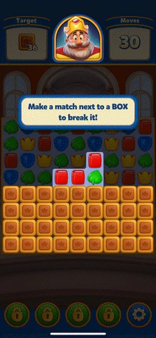

### 玩法机制

- Box 是游戏中最基础的障碍元素，最多有 **4 层**状态
- 在 Box 旁边进行消除匹配，或使用 Power-up 命中，每次移除一层
- 4 层全部消除后，Box 从棋盘移除
- Box 是 **Steady** 类型，固定在棋盘上不会移动

### Blender 建模要点

- **形状**: 木质方箱，立体正方形
- **材质**: 木纹材质，4 层状态对应从完整到破损的渐变
- **关键细节**: 每层状态需要有明显的视觉差异（如裂缝增加、木板脱落）
- **状态数**: 需要 4 个模型状态（state 3/2/1/0）

---

## 2. Grass（草地）

> **Wiki**: [https://royalmatch.fandom.com/wiki/Grass](https://royalmatch.fandom.com/wiki/Grass)

| 属性 | 值 |
|------|-----|
| Element # | 2 |
| 首次出现 | Level 4 |
| 分类 | Lower Layer（底层） |
| 移动类型 | Steady（静止） |
| 消除方式 | Match（在其上消除）或 Power-up |
| 层数/状态 | 2 种变体（深色/浅色） |

### 外观

| 深色草地（2次消除） | 浅色草地（1次消除） |
|:---:|:---:|
| 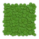 | 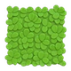 |

### 教程演示

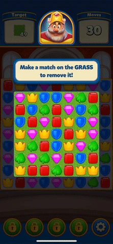

### 玩法机制

- Grass 是 **底层（Lower Layer）** 元素，位于棋盘格子的底部
- 在 Grass 上方进行消除匹配即可清除（注意：是"在其上"消除，不是"旁边"）
- **深色草地**: 需要消除 **2 次** 才能清除
- **浅色草地**: 消除 **1 次** 即可清除
- Power-up 命中也可以清除

### Blender 建模要点

- **形状**: 平面/低矮的草地纹理覆盖，贴合棋盘格子底部
- **材质**: 绿色草地纹理，深色和浅色两种变体
- **关键细节**: 底层元素，厚度很薄，视觉上是棋盘格子的"地面"装饰
- **状态数**: 2 个变体模型（深色 + 浅色）

---

## 3. Cupboard（橱柜）

> **Wiki**: [https://royalmatch.fandom.com/wiki/Cupboard](https://royalmatch.fandom.com/wiki/Cupboard)

| 属性 | 值 |
|------|-----|
| Element # | 3 |
| 首次出现 | Level 11 |
| 分类 | Container（容器） |
| 移动类型 | Steady（静止） |
| 消除方式 | Match（旁边消除）或 Power-up |
| 内容物 | Plate（盘子） |

### 外观

| 关闭状态 | 打开状态 |
|:---:|:---:|
| 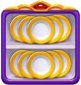 | 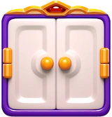 |

### 教程演示

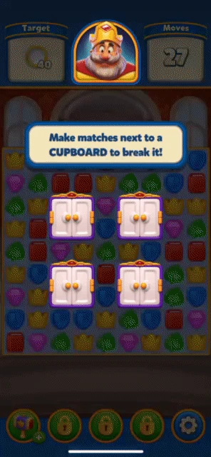

### 玩法机制

- Cupboard 是 **容器** 类元素，内部存放着 **Plate（盘子）**
- 在 Cupboard 旁边进行消除匹配，或使用 Power-up 命中，可以打开橱柜
- 打开后释放内部的 Plate，Plate 是关卡的收集目标
- Cupboard 固定在棋盘上不会移动

### Blender 建模要点

- **形状**: 小型木质橱柜，有可开合的柜门
- **材质**: 木质材质，装饰性柜门把手
- **关键细节**: 需要开/关两个状态；内部需要可见的盘子道具
- **状态数**: 2 个状态（关闭 + 打开），额外需要 Plate 子模型

---

## 4. Mailbox（邮箱）

> **Wiki**: [https://royalmatch.fandom.com/wiki/Mailbox](https://royalmatch.fandom.com/wiki/Mailbox)

| 属性 | 值 |
|------|-----|
| Element # | 4 |
| 首次出现 | Level 21 |
| 分类 | Generator（生成器） |
| 移动类型 | Steady（静止） |
| 消除方式 | Match（旁边消除）触发生成 |
| 产出物 | Envelope（信封） |

### 外观

| 打开状态 | 关闭状态 | 信封 |
|:---:|:---:|:---:|
|  |  |  |

### 教程演示

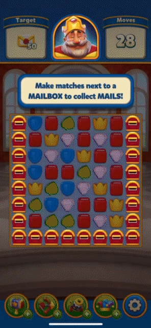

### 玩法机制

- Mailbox 是 **生成器** 类元素，**不会被消除**，而是产出信封
- 在 Mailbox 旁边消除匹配或使用 Power-up 命中，会生成 **Envelope（信封）**
- 信封是关卡的收集目标，收集足够数量后 Mailbox 关闭
- 提示文字："Make matches next to the Mailbox and collect Envelopes!"

### Blender 建模要点

- **形状**: 经典美式邮箱造型（圆顶+小旗子）
- **材质**: 金属/木质混合，鲜艳颜色
- **关键细节**: 打开/关闭两个状态，邮箱口可见信封；需要单独的信封模型
- **状态数**: 2 个状态（开/关），1 个信封子模型

---

## 5. Royal Egg（皇家蛋）

> **Wiki**: [https://royalmatch.fandom.com/wiki/Royal_Egg](https://royalmatch.fandom.com/wiki/Royal_Egg)

| 属性 | 值 |
|------|-----|
| Element # | 5 |
| 首次出现 | Level 31 |
| 分类 | Layered |
| 移动类型 | Moving（可移动） |
| 消除方式 | Match（旁边消除）或 Power-up |
| 层数/状态 | 1 层 |

### 外观

### 教程演示

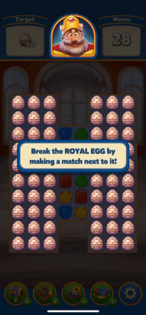

### 玩法机制

- Royal Egg 是 **单层** 可移动障碍，消除 1 次即可清除
- 作为 **Moving** 类型，Royal Egg 会随重力下落
- 在其旁边消除匹配或使用 Power-up 命中即可移除
- 这是游戏中首个引入的 Moving 类型元素

### Blender 建模要点

- **形状**: 金色/皇冠装饰的蛋形
- **材质**: 金属质感，带有皇家装饰花纹
- **关键细节**: 蛋形光滑表面，顶部有皇冠或宝石装饰
- **状态数**: 1 个状态

---

## 6. Potion Bottle（药水瓶）

> **Wiki**: [https://royalmatch.fandom.com/wiki/Potion_Bottle](https://royalmatch.fandom.com/wiki/Potion_Bottle)

| 属性 | 值 |
|------|-----|
| Element # | 6 |
| 首次出现 | Level 41 |
| 分类 | Container（容器） |
| 移动类型 | Steady（静止） |
| 消除方式 | **Colored Match**（颜色匹配消除） |
| 内容物 | Potion（药水） |

### 外观

| 信息图 | 红色 | 黄色 | 绿色 | 蓝色 | 粉色 |
|:---:|:---:|:---:|:---:|:---:|:---:|
| 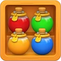 | 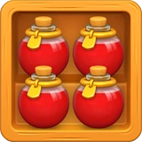 | 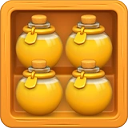 | 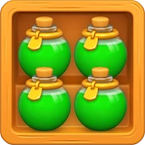 | 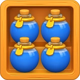 | 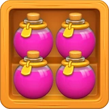 |

### 教程演示

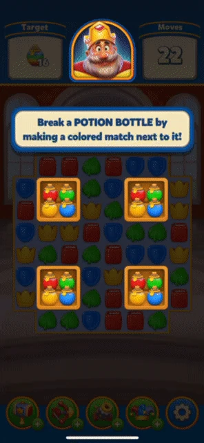

### 玩法机制

- Potion Bottle 是 **容器** 类元素，内部有 **4 个不同颜色的小瓶子**
- **颜色匹配机制**: 必须用与小瓶子**相同颜色**的棋子在旁边进行消除
  - 例如：红色书本匹配 → 打碎红色小瓶
  - 绿色叶子匹配 → 打碎绿色小瓶
- 打碎全部 4 个小瓶后，Potion Bottle 被清除
- Power-up 无视颜色限制，直接造成伤害
- 提示："Make matches with like colors next to the Potion Bottle to break a bottle!"

### Blender 建模要点

- **形状**: 大型药水瓶，内含 4 个小型彩色药水瓶
- **材质**: 玻璃质感（透明/半透明），内部小瓶有红/黄/绿/蓝/粉 5 种颜色变体
- **关键细节**: 需要表现出玻璃透明感，内部小瓶逐个被打碎的过程
- **状态数**: 5 种颜色变体 × 多个打碎进度状态

---

## 7. Vase（花瓶）

> **Wiki**: [https://royalmatch.fandom.com/wiki/Vase](https://royalmatch.fandom.com/wiki/Vase)

| 属性 | 值 |
|------|-----|
| Element # | 7 |
| 首次出现 | Level 51 |
| 分类 | Layered |
| 移动类型 | Moving（可移动） |
| 消除方式 | Match（旁边消除）或 Power-up |
| 层数/状态 | 2 层 |

### 外观（2层状态）

| 状态 1（完整） | 状态 0（破裂） |
|:---:|:---:|
|  |  |

### 教程演示

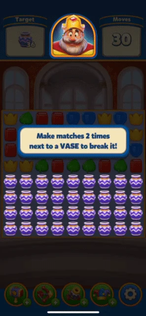

### 玩法机制

- Vase 有 **2 层** 状态，需要消除 2 次才能清除
- 作为 **Moving** 类型，Vase 会随重力下落
- 在其旁边消除匹配或使用 Power-up 命中，每次移除一层

### Blender 建模要点

- **形状**: 陶瓷花瓶造型
- **材质**: 陶瓷/瓷器材质，有装饰花纹
- **关键细节**: 完整状态 → 出现裂纹状态的渐变
- **状态数**: 2 个状态（完整 + 破裂）

---

## 8. Owl（猫头鹰雕像）

> **Wiki**: [https://royalmatch.fandom.com/wiki/Owl](https://royalmatch.fandom.com/wiki/Owl)

| 属性 | 值 |
|------|-----|
| Element # | 8 |
| 首次出现 | Level 61 |
| 分类 | Layered |
| 移动类型 | Steady（静止） |
| 消除方式 | **Power-up Only**（仅 Power-up） |
| 层数/状态 | 1 |

### 外观

### 教程演示

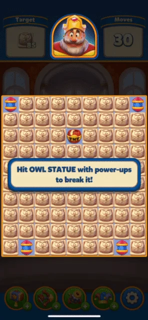

### 玩法机制

- Owl 是 **仅能通过 Power-up 消除** 的障碍元素
- **普通匹配消除无效**，必须使用 Power-up（如火箭、炸弹等）命中
- 这是游戏中首个引入"Power-up Only"机制的元素
- 增加了玩家对 Power-up 的策略性使用需求

### Blender 建模要点

- **形状**: 石质猫头鹰雕像
- **材质**: 石头/大理石材质，灰色调
- **关键细节**: 雕像感，庄重的猫头鹰造型，石质纹理
- **状态数**: 1 个状态

---

## 9. Bush（灌木）

> **Wiki**: [https://royalmatch.fandom.com/wiki/Bush](https://royalmatch.fandom.com/wiki/Bush)

| 属性 | 值 |
|------|-----|
| Element # | 9 |
| 首次出现 | Level 71 |
| 分类 | Layered |
| 移动类型 | Steady（静止） |
| 消除方式 | Match（旁边消除）或 Power-up |
| 层数/状态 | 5 层 |
| 特殊效果 | 消除后向周围扩散 Grass |

### 外观

| 状态 4（满层） | 状态 0（即将消除） |
|:---:|:---:|
| 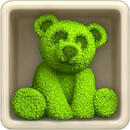 | 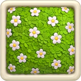 |

### 教程演示

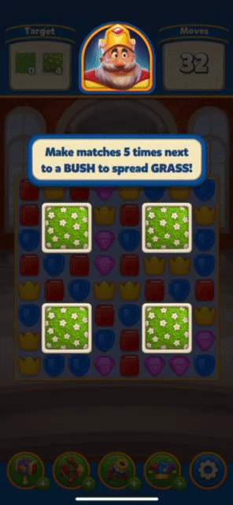

### 玩法机制

- Bush 有 **5 层** 状态，需要消除 5 次
- 在旁边消除匹配或使用 Power-up 命中，每次移除一层
- **特殊机制**: 完全消除后，会在周围 **4×4 区域（16格）扩散 Grass**
- 这意味着 Bush 既是障碍，也是一个有益元素（消除后产生 Grass 目标）
- Bush 与 Grass 元素联动，形成关卡设计的组合机制

### Blender 建模要点

- **形状**: 圆润的灌木丛造型
- **材质**: 绿色植物叶片纹理
- **关键细节**: 5 层状态需要表现灌木从茂密到稀疏的过程；消除时有草地扩散特效
- **状态数**: 5 个状态（state 4/3/2/1/0）

---

## 10. Honey（蜂蜜）

> **Wiki**: [https://royalmatch.fandom.com/wiki/Honey](https://royalmatch.fandom.com/wiki/Honey)

| 属性 | 值 |
|------|-----|
| Element # | 10 |
| 首次出现 | Level 81 |
| 分类 | Upper Layer（覆盖层） |
| 移动类型 | Steady（静止） |
| 消除方式 | Match（旁边消除）或 Power-up |
| 层数/状态 | 1 |

### 外观

### 教程演示

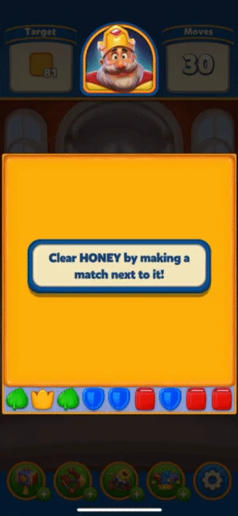

### 玩法机制

- Honey 是 **覆盖层（Upper Layer）** 元素，覆盖在棋盘格子上方
- 被覆盖的格子下方可能有其他元素或棋子，**必须先清除 Honey 才能操作下方内容**
- 在 Honey 旁边消除匹配或使用 Power-up 命中可以清除
- Honey 的核心设计在于它**限制了玩家对特定区域的操作**，需要优先处理

### Blender 建模要点

- **形状**: 平面蜂蜜覆盖效果，覆盖在格子表面
- **材质**: 金黄色半透明粘稠蜂蜜材质，有光泽和流动感
- **关键细节**: 需要表现半透明效果，能隐约看到下方被覆盖的内容
- **状态数**: 1 个状态

---

## 11. Safe（保险箱）

> **Wiki**: [https://royalmatch.fandom.com/wiki/Safe](https://royalmatch.fandom.com/wiki/Safe)

| 属性 | 值 |
|------|-----|
| Element # | 11 |
| 首次出现 | Level 91 |
| 分类 | Layered |
| 移动类型 | Steady（静止） |
| 消除方式 | **Power-up Only**（仅 Power-up） |
| 层数/状态 | 5 层 |

### 外观

| 状态 4（满层） | 状态 0（即将打开） |
|:---:|:---:|
| 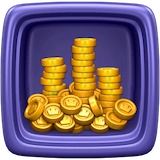 | 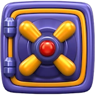 |

### 教程演示

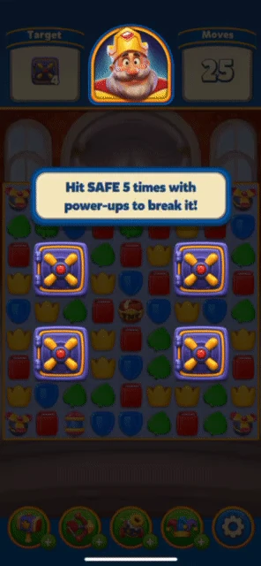

### 玩法机制

- Safe 有 **5 层** 状态，且 **只能通过 Power-up 消除**
- 普通匹配消除无效，必须使用 Power-up 命中
- 结合了"多层"和"Power-up Only"两种机制，是前期最具挑战性的障碍之一
- 5 层状态有明显的视觉破损进度

### Blender 建模要点

- **形状**: 金属保险箱，有转盘密码锁
- **材质**: 金属/钢铁材质，厚重感
- **关键细节**: 5 层状态表现从完整到破损开裂的过程；密码锁、铰链等细节
- **状态数**: 5 个状态（state 4/3/2/1/0）

---

## 12. Bird（小鸟）

> **Wiki**: [https://royalmatch.fandom.com/wiki/Bird](https://royalmatch.fandom.com/wiki/Bird)

| 属性 | 值 |
|------|-----|
| Element # | 12 |
| 首次出现 | Level 101 |
| 分类 | Downward（下落收集） |
| 移动类型 | Moving（可移动） |
| 消除方式 | **Collect**（移动至底部收集） |
| 层数/状态 | 无层数概念 |

### 外观

### 教程演示

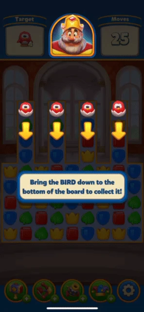

### 玩法机制

- Bird 是 **下落收集** 类元素，与其他障碍完全不同
- **不需要消除或打碎**，而是需要将 Bird 移动到棋盘**最底部**来收集
- 玩家通过消除 Bird 下方的棋子，让 Bird 随重力逐步下落
- 提示："Bring the Birds to the ground to collect them!"
- 这是一个 **路径规划** 型机制，考验玩家对棋盘空间的理解

### Blender 建模要点

- **形状**: 可爱卡通小鸟造型
- **材质**: 彩色羽毛，卡通风格
- **关键细节**: 需要表现活泼可爱的感觉；可能需要一个"目标位置"指示器模型
- **状态数**: 1 个状态（但需要下落动画）

---

## 13. Color Box（彩色箱子）

> **Wiki**: [https://royalmatch.fandom.com/wiki/Color_Box](https://royalmatch.fandom.com/wiki/Color_Box)

| 属性 | 值 |
|------|-----|
| Element # | 13 |
| 首次出现 | Level 121 |
| 分类 | Layered |
| 移动类型 | Steady（静止） |
| 消除方式 | **Colored Match**（颜色匹配消除） |
| 层数/状态 | 3 层 × 5 种颜色 |
| 可用颜色 | 蓝、绿、粉、红、黄 |

### 外观

| 信息图 | 蓝色（满层） | 红色（满层） |
|:---:|:---:|:---:|
|  |  |  |

### 教程演示

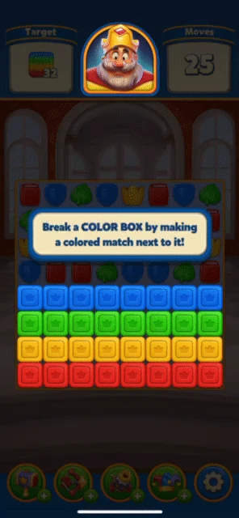

### 玩法机制

- Color Box 有 **3 层**，且需要 **颜色匹配** 才能消除
- **颜色匹配规则**: 旁边消除的匹配颜色必须与 Color Box 的颜色一致
  - 蓝色 Color Box → 需要蓝色棋子消除
  - 红色 Color Box → 需要红色棋子消除
- Power-up 无视颜色限制，直接造成伤害
- 每种颜色有 3 个视觉状态（层 2/1/0）
- 5 种可用颜色：蓝、绿、粉、红、黄

### Blender 建模要点

- **形状**: 彩色的立方体箱子，表面有颜色标识
- **材质**: 彩色涂装，5 种颜色变体
- **关键细节**: 每种颜色 3 层破损状态 = 共 15 个状态模型（或使用材质切换）
- **状态数**: 5 色 × 3 层 = 15 个变体

---

## 14. Ice（冰块）

> **Wiki**: [https://royalmatch.fandom.com/wiki/Ice](https://royalmatch.fandom.com/wiki/Ice)

| 属性 | 值 |
|------|-----|
| Element # | 14 |
| 首次出现 | Level 141 |
| 分类 | Other |
| 移动类型 | Steady（静止） |
| 消除方式 | Match（旁边消除）或 Power-up |

### 外观

### 教程演示

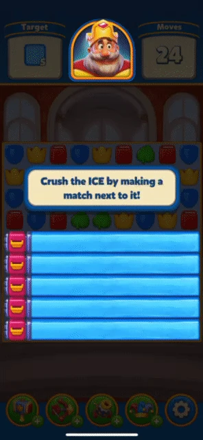

### 玩法机制

- Ice 可以通过在旁边消除匹配或使用 Power-up 来打碎
- 后期变体 **Potion Tube**（Level 9401 引入）需要颜色匹配才能消除
- Ice 的基础版本没有颜色限制

### Blender 建模要点

- **形状**: 冰块/冰晶造型，有棱角的透明固体
- **材质**: 透明/半透明冰材质，折射和反射效果
- **关键细节**: 需要冰的透明质感，内部可能冻住其他元素
- **状态数**: 1 个基础状态

---

## 15. Porcelain Piggy（瓷器小猪）

> **Wiki**: [https://royalmatch.fandom.com/wiki/Porcelain_Piggy](https://royalmatch.fandom.com/wiki/Porcelain_Piggy)

| 属性 | 值 |
|------|-----|
| Element # | 15 |
| 首次出现 | Level 161 |
| 分类 | Layered |
| 移动类型 | Moving（可移动） |
| 消除方式 | **Power-up Only**（仅 Power-up） |
| 层数/状态 | 1 |

### 外观

### 教程演示

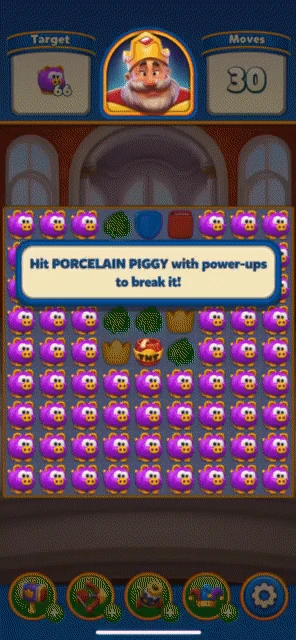

### 玩法机制

- Porcelain Piggy **只能通过 Power-up 消除**，普通匹配无效
- 作为 **Moving** 类型，它会随重力下落移动
- 结合了"Power-up Only"和"Moving"两种特性
- 移动特性使其位置不固定，增加了瞄准 Power-up 的难度

### Blender 建模要点

- **形状**: 可爱的瓷器小猪储蓄罐造型
- **材质**: 光滑的瓷器材质，有光泽
- **关键细节**: 圆润可爱的小猪造型，瓷器的光泽感和易碎感
- **状态数**: 1 个状态（碎裂为消除动画）

---

## 16. Curtain（幕帘）

> **Wiki**: [https://royalmatch.fandom.com/wiki/Curtain](https://royalmatch.fandom.com/wiki/Curtain)

| 属性 | 值 |
|------|-----|
| Element # | 16 |
| 首次出现 | Level 181 |
| 分类 | Special（特殊） |
| 移动类型 | Steady（静止） |
| 消除方式 | Match（收集指定数量的棋子） |
| 颜色变体 | 蓝、绿、粉、黄、红 |

### 外观

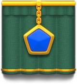

### 教程演示

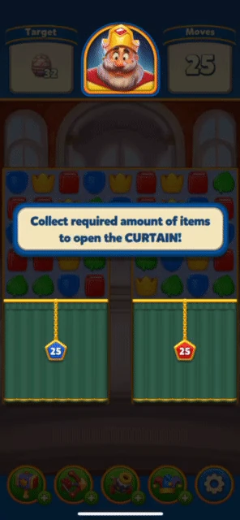

### 玩法机制

- Curtain 是 **特殊** 类元素，**覆盖棋盘的一部分区域**
- 要打开 Curtain，需要**收集指定数量的对应颜色棋子**
- Curtain 有 5 种颜色变体（蓝、绿、粉、黄、红）
- 打开后露出被遮盖的棋盘区域
- 后期变体 **Royal Criptex**（Level 8601）需要按特定顺序消除

### Blender 建模要点

- **形状**: 舞台幕帘/窗帘造型，覆盖多个格子
- **材质**: 织物/天鹅绒质感，5 种颜色变体
- **关键细节**: 需要表现布料的褶皱和垂坠感；打开动画需要向两侧拉开
- **状态数**: 5 种颜色 × 开/关状态

---

## 17. Oyster（牡蛎）

> **Wiki**: [https://royalmatch.fandom.com/wiki/Oyster](https://royalmatch.fandom.com/wiki/Oyster)

| 属性 | 值 |
|------|-----|
| Element # | 17 |
| 首次出现 | Level 201 |
| 分类 | Layered |
| 移动类型 | Moving（可移动） |
| 消除方式 | Match（旁边消除）或 Power-up |
| 层数/状态 | 3 层 |
| 产出物 | Pearl（珍珠） |

### 外观（3层状态）

| 状态 2（关闭） | 状态 0（打开） |
|:---:|:---:|
|  |  |

### 教程演示

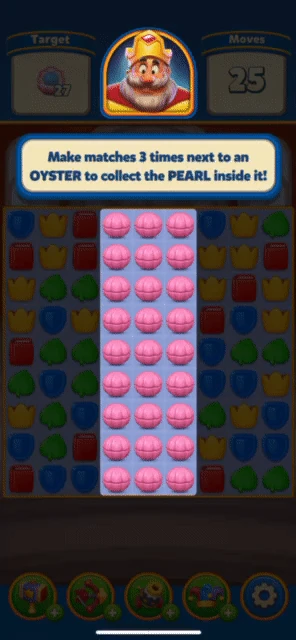

### 玩法机制

- Oyster 有 **3 层** 状态，需要消除 3 次
- 在旁边消除匹配或使用 Power-up 命中，每次移除一层
- 完全打开后释放 **Pearl（珍珠）**，珍珠是收集目标
- 作为 **Moving** 类型，Oyster 会随重力下落

### Blender 建模要点

- **形状**: 贝壳/牡蛎造型，有上下两半壳
- **材质**: 贝壳材质（外部粗糙，内部珍珠光泽）
- **关键细节**: 3 层状态表现从紧闭到半开到完全打开的过程；内部需要珍珠模型
- **状态数**: 3 个状态 + 1 个珍珠子模型

---

## 18. Magic Hat（魔法帽）

> **Wiki**: [https://royalmatch.fandom.com/wiki/Magic_Hat](https://royalmatch.fandom.com/wiki/Magic_Hat)

| 属性 | 值 |
|------|-----|
| Element # | 18 |
| 首次出现 | Level 231 |
| 分类 | Generator（生成器） |
| 移动类型 | Steady（静止） |
| 消除方式 | Match（旁边消除 3 次触发） |
| 产出物 | Diamond（钻石） |

### 外观

| 打开状态 | 关闭状态 |
|:---:|:---:|
|  |  |

### 教程演示

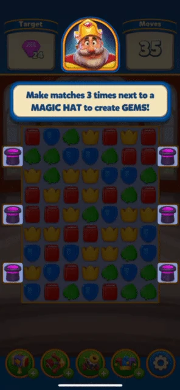

### 玩法机制

- Magic Hat 是 **生成器** 类元素，在旁边消除 **3 次** 后生成 **Diamond（钻石）**
- 钻石是关卡的收集目标
- 当生成足够数量的钻石后，Magic Hat 翻转关闭
- 提示："Match 3 times next to the Magic Hats to get more Diamonds!"
- 部分关卡中钻石不是直接目标，Magic Hat 用于与粉色 Potion Bottle 或 Drill 交互

### Blender 建模要点

- **形状**: 经典魔术师高帽造型
- **材质**: 黑色天鹅绒/丝绸材质，帽带装饰
- **关键细节**: 打开/关闭两种状态；打开时需要有"变出钻石"的魔术效果暗示
- **状态数**: 2 个状态（开/关）+ 1 个钻石子模型

---

## 19. Flowerpot（花盆）

> **Wiki**: [https://royalmatch.fandom.com/wiki/Flowerpot](https://royalmatch.fandom.com/wiki/Flowerpot)

| 属性 | 值 |
|------|-----|
| Element # | 19 |
| 首次出现 | Level 261 |
| 分类 | Layered |
| 移动类型 | Moving（可移动） |
| 消除方式 | Match（旁边消除）或 Power-up |
| 层数/状态 | 2 层 |
| 特殊效果 | 消除后扩散 9 片 Leaves（3×3） |

### 外观

| 状态 1（完整） | 状态 2（破裂） | 扩散的叶子 |
|:---:|:---:|:---:|
|  |  |  |

### 教程演示

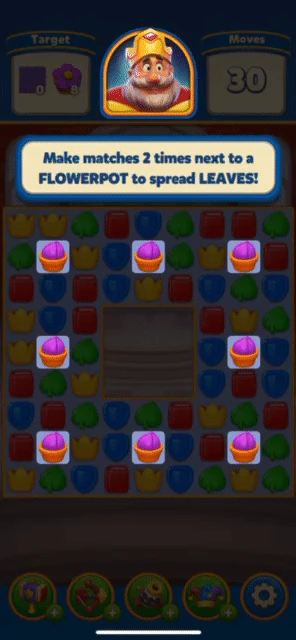

### 玩法机制

- Flowerpot 有 **2 层** 状态
- 完全消除后，在 Flowerpot 所在位置的 **3×3 区域扩散 9 片 Leaves（叶子）**
- Leaves 的行为与 Grass 相同，可以通过在其上消除来清除
- 与 Bush（扩散 4×4 Grass）类似，Flowerpot 也是"障碍+有益效果"的双重设计
- 作为 **Moving** 类型，Flowerpot 会随重力下落

### Blender 建模要点

- **形状**: 陶土花盆造型，上方有植物
- **材质**: 陶土/红砖色花盆，绿色植物
- **关键细节**: 2 层状态（完整 → 破裂）；消除时的叶子扩散效果
- **状态数**: 2 个状态 + 叶子子模型

---

## 20. Stone（石头）

> **Wiki**: [https://royalmatch.fandom.com/wiki/Stone](https://royalmatch.fandom.com/wiki/Stone)

| 属性 | 值 |
|------|-----|
| Element # | 20 |
| 首次出现 | Level 301 |
| 分类 | Layered |
| 移动类型 | Steady（静止） |
| 消除方式 | **Power-up Only**（仅 Power-up） |
| 层数/状态 | 3 层 |

### 教程演示

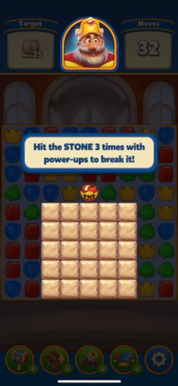

### 玩法机制

- Stone 有 **3 层** 状态，且 **只能通过 Power-up 消除**
- 普通匹配消除无效，必须使用 Power-up 命中
- 结合了"多层"（3层）和"Power-up Only"机制
- 与 Safe（5层 Power-up Only）相比层数更少，但同样需要策略性使用 Power-up

### Blender 建模要点

- **形状**: 天然岩石/石块造型
- **材质**: 石头材质，灰色/棕灰色，粗糙表面
- **关键细节**: 3 层状态表现从完整到逐渐碎裂的过程
- **状态数**: 3 个状态

---

## 机制设计模式总结

### 消除方式分类

| 消除方式 | 元素 | 设计意图 |
|---------|------|---------|
| **Match（普通匹配）** | Box, Grass, Cupboard, Royal Egg, Vase, Bush, Honey, Ice, Oyster, Flowerpot | 基础消除，旁边或其上消除即可 |
| **Power-up Only** | Owl, Safe, Porcelain Piggy, Stone | 强制玩家合成和使用 Power-up |
| **Colored Match（颜色匹配）** | Potion Bottle, Color Box | 增加消除条件限制 |
| **Generator（生成）** | Mailbox, Magic Hat | 不被消除，而是产出目标物品 |
| **Collect（收集）** | Bird | 路径规划型，移到底部收集 |
| **Special（特殊收集）** | Curtain | 收集指定数量棋子后打开 |

### 层级复杂度递进

| 层数 | 元素 |
|------|------|
| 1 层 | Royal Egg, Owl, Honey, Ice, Porcelain Piggy |
| 2 层 | Vase, Flowerpot |
| 3 层 | Oyster, Color Box, Stone |
| 4 层 | Box |
| 5 层 | Bush, Safe |

### 联动机制

| 元素 | 联动目标 | 效果 |
|------|---------|------|
| Bush | Grass | 消除后扩散 4×4 Grass |
| Flowerpot | Leaves | 消除后扩散 3×3 Leaves（类 Grass 行为） |
| Mailbox | Envelope | 产出信封收集目标 |
| Magic Hat | Diamond | 产出钻石收集目标 |
| Cupboard | Plate | 释放盘子收集目标 |
| Oyster | Pearl | 释放珍珠收集目标 |
